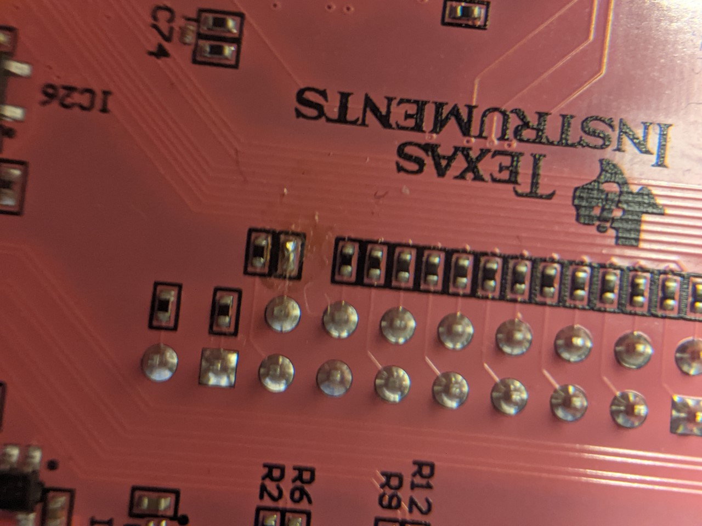

> :warning: This document applies only to using PYNQ-Z1 with the FOBOS Shield rev 1.0 and the CW305 board.

# Requirements

1. Vivado 2020.2 is required to build the project. It must be on the PATH, i.e. it can be invoked directrly from the shell.

# Build the project from source

Using a command line:

1. Run `cd fobos/control/pynqctrl/vivado/`.
2. Run `make create_project`
3. Open Vivado and open the project at `fobos/control/pynqctrl/vivado/pynq_controller`.
4. In the sources window, replace the ctrl_top_wrapper file with `ctrl_top_wrapper_shield_v1.vhd`.
5. In the sources window, disable all constraint files and add `pynq_shield_v1_cw305_half_duplex.xdc` instead.
6. In the sources window, right-click on the `ctrl_top.bd` block design and select `Generate Output Products ...`. Then select `Global` then `Generate`. Wait for this to finish.
7. Generate your bitstream from Vivado's Flow Navigator.
8. Go and make yourself a cup of coffee or tea, this is going to take a while.
9. Copy the the `fobos/control/pynqctrl/vivado/pynq_controller/pynq_controller.runs/impl_1/ctrl_top_wrapper.bit` to `fobos/software/` and rename it to `pynq_ctrl.bit`.
10. Copy the the `fobos/control/pynqctrl/vivado/pynq_controller/pynq_controller.gen/sources_1/bd/ctrl_top/hw_handoff/ctrl_top.hwh` to `fobos/software/` and rename it to `pynq_ctrl.hwh`.

# Preparing the control board

## Modification to the board
On the PYNQ board, remove the resistor R76, the 200 Ohm resistor for IO41 and replace it with a blob of solder. This is connected to the ADC clock. If this resistor exists, it will form a voltage divider with R18 on the FOBOS-Shield reducing the volatge of the ADC clock.




## Board settings

1. Copy the `fobos/` directory to the PYNQ board `/home/xilinx` directory.
2. Edit the file `fobos/software/pynqserver.py` to change the IP address to the correct address of the PYNQ board (TO BE CHANGED TO BE AUTOMATIC).
3. Allow the xilinx user to be able to use sudo whithout password. This is needed to run control software which needs access to hardware. Use the command `sudo visudo` to add the following to the sudoers file: `xilinx ALL=(ALL) NOPASSWD:ALL`. 
4. Add the following line to `/etc/crontab` to start/restart the control software  `*/5  *    * * *   xilinx   cd /home/xilinx/fobos/software/ && sudo python3 /home/xilinx/fobos/software/serverWatchdog.py >>/tmp/fobos.log 2>&1`
5. As an alternative to step 4, you may run `pynqserver.py` directly from the shell by running `cd fobos/software` then `sudo python3 pynqserver.py`.
6. Now the pynqserver is ready to receive connections from the host machine.

# Test Run
1. Use the example AES core as the crypto core. This core lives at `fobos/dut/example_cores/AES-128/vhdl`. As a wrapper, use the half_duplex FPGA wrapper at `fobos/dut/example_cores/AES-128/vhdl`. Use the `cw305_half_duplex.xdc` file.
2. Generate the DUT bitstream and use it to program the CW305 board.
3. Move to the `fobos/software/notebooks/sca_labs/`, remove the `fobsolib` symlink and correct it using the command `ln -s ../foboslib/ foboslib`.
4. Open Jupyter-notebook and run the file `fobos/software/notebooks/sca_labs/data_acquisition-aes.ipynb`.

# Note about lock file
 Lock file is located at `/tmp/fobos.lock`. If this file is removed, the lock is released. (TO DO. create a method to avoid using the lock in signle user mode). Now locking is disabled.

# Modify the project
## NEEDS UPDATE
1. Add your IPs under `fobos/sources/pynq_controller/vivado/ip_repo` under their own folders.
2. Modify the block design using Vivado GUI.
3. Export the updated block design to `fobos/sources/pynq_controller/vivado/src/bd/ctrl_top_wrapper.tcl` (File-> Export -> Export Block Design...). 
4. Export the project tcl file to `fobos/sources/pynq_controller/vivado/build_proj.tcl`.
5. Commit the changes to the ip_repo folder, ctrl_top.tcl and build_proj.tcl.

# Synthesize the project
## NEEDS UPDATE
1. Open the project in Vivado. In Vivado's sources window, right-click the block design file (ctrl_top.bd) and select "Generate Output Products...".
2. The Generate Output Products window, select "Global" under Synthesis Options then click "Generate".
3. After the output products generation completes, click Generate Bitstream.
4. Copy the generated bitstream to `fobos/sources/pynq_controller/python3/`.
5. Generate block diagram tcl file. Open the block diagram then issue the `write_bd_tcl` command in the TCL console.
6. Copy the generated block diagram tcl file to `fobos/sources/pynq_controller/python3/`. Make sure it is named `ctrl_top_wrapper.tcl`.


# Committing updated project into GIT
## NEEDS UPDATE
* In Vivado open block design and go to the Menu: File -> Project -> Write TCL
* Select options: Copy sources to new project
* Open the resulting file and make the following edits
  * remove all lines till but not including: `set origin_dir`
  * remove lines from including:  `# Set 'sources_1' fileset object`
                 till not including:  `# Set 'sources_1' fileset properties`
  * Add at the end of the file:
  
```
#######Added manually to create block design and wrapper
## Create block design
# source $origin_dir/src/bd/ctrl_top.tcl
#
## Generate the wrapper
# set design_name [get_bd_designs]
# make_wrapper -files [get_files $design_name.bd] -top -import
#
######END ADDED
```
* On the command line execute: `mv pynq_controller.tcl build_proj.tcl`
* Create block diagram tcl file by using the Vivado tcl console and type `write_bd_tcl ctrl_top.tcl`
* move this file using in the command line: `mv ctrl_top.tcl src/bd/`
