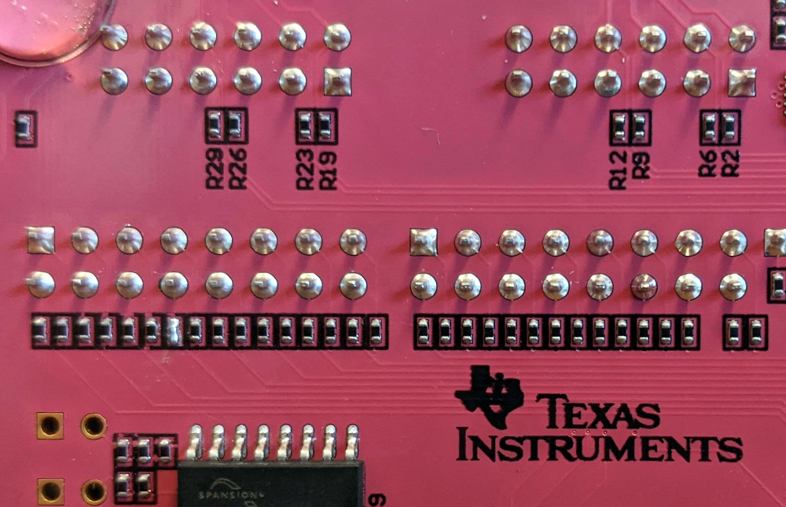

# Requirements

Vivado 2020.2 is required to build the project. It must be on the PATH, i.e. it can be invoked directrly from the shell.

# Build the project from source

Using a command line:

1. `cd fobos/sources/pynq_controller/vivado/`.
2. `make create_project`
3. `make synth`
4. Go and make yourself a cup of coffee or tea, this is going to take a while
5. When Vivado is done, you will have the files `pynq_ctrl.bit` and `pynq_ctrl.hwh` in this directory.


# Preparing the control board

1. Copy the `fobos/software directory to the /home/xilinx/ directory on the Pynq board using scp or sftp.
1. Copy the files `pynq_ctrl.bit` and `pynq_ctrl.hwh` from fobos/sources/pynq_controller/vivado to your Pynq board into the /home/xilinx/fobos/software/ directory.  
1. Use ssh to get a comand prompt on the Pynq board, change directory to the fobos/software directory and run the script `sudo ./install-pynq.sh`. It will ask you several questions about your Pynq setup, install the necessary files, and start the pynqserver.

# Modifying the Pynq board
On the Pynq board, the 200 Ohm resistor R88 in the line IO29 of the ADC clock has to be removed and replaced with a blob of solder. The resistor attenuates the ADC clock signal too much.




# Test Run
**This section needs updating**
 1. In the PC connected to the PYNQ board. Open Jupyter-notebook and run the file `fobos/software/capture_traces_v3.ipynb`.

# Note about lock file

A lock file is created on the SCA Workstation each time a user tries to access the DUT. The file is located at `/tmp/fobos.lock`. Normally this file is automatically removed after the user releases the DUT connection. It the Jupyter Notebook crashes however, this file will stay and block access to the DUT. Remove this file manually and the lock is released. 

# Modify the project

1. Follow the first 2 steps of the *Built the project from source* instructions.
1. Open Vivado and open the newly created project `fobos/control/pynqctrl/vivado/pynq_controller/pynq_controller.xpr`
1. Open the block design.
1. New IPs can be added under `fobos/control/ip_repo` into their own folders.
1. To modify existing IPs by right-click on the IP in the block design and select `Edit in IP Packager`
1. When all changes are done run Synthesis and then Generate Bitstream
1. Exit Vivado
1. Copy the generated bit file and hwh file into the `fobos/sources/pynq_controller/vivado/` directory 
   `cp pynq_controller/pynq_controller.gen/sources_1/bd/ctrl_top/hw_handoff/ctrl_top.hwh pynq_ctrl.hwh`
   `cp pynq_controller/pynq_controller.runs/impl_1/ctrl_top_wrapper.bit pynq_ctrl.bit`
1. Then copy these files to the Pynq board `/home/xilinx/fobos/software` directory for testing.
1. Once everything works follow the instructions for *Committing updated project into GIT*


# Committing updated project into GIT

* In Vivado open block design and go to the Menu: File -> Project -> Write TCL
* Select options: Copy sources to new project
* Open the resulting file and make the following edits
  * remove all lines till but not including: `set origin_dir`
  * remove lines from including:  `# Set 'sources_1' fileset object`
                 till not including:  `# Set 'sources_1' fileset properties`
  * Add at the end of the file:
```
#######Added manually to create block design and wrapper
## Create block design
# source $origin_dir/src/bd/ctrl_top.tcl
#
## Generate the wrapper
# set design_name [get_bd_designs]
# make_wrapper -files [get_files $design_name.bd] -top -import
#
######END ADDED
```
* On the command line execute: `mv pynq_controller.tcl build_proj.tcl`
* Create block diagram tcl file by using the Vivado tcl console and type `write_bd_tcl ctrl_top.tcl`
* move this file using in the command line: `mv ctrl_top.tcl src/bd/`


