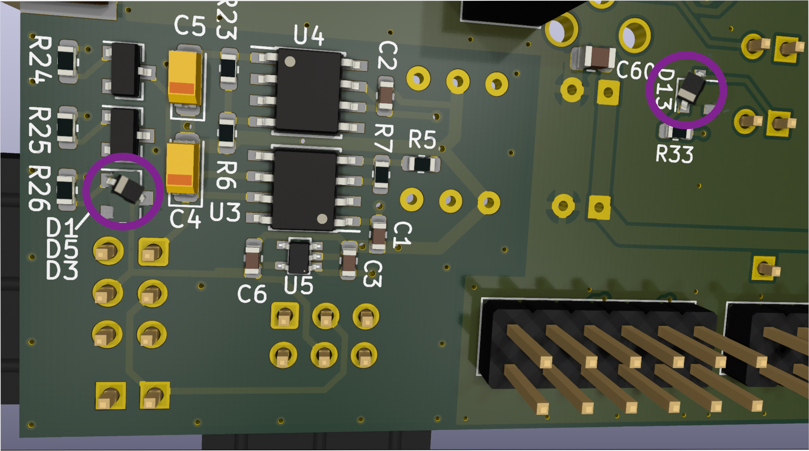

.. _control-fobos-shield-label:

FOBOS Shield 
============
The FOBOS Shield is a circuit board developed by CERG. It connects to the Pynq board and 
contains:

* An implementation of OpenADC with: 
    * A 10-bit ADC, 40MHz bandwidth, up to 105 MS/s and
    * An adjustable low noise amplifier.
* Power supply for the DUT with:
    * Three different outputs: 5V, 3.3V, and a variable output that can be programmed to 
      supply a voltage from 0.90V to 3.65V in 0.05V steps,
    * Current sense monitors on all three outputs with adjustable gain in 4 steps, and
    * Connections to use the XADC of the Zynq chip on the Pynq board to measure 
      voltage and current of all three outputs. 
* Simple crowbar glitch circuit.
* 20-pin Target connector to attach a DUT. This connector is ChipWhisperer compatible.
* Isolated power supply providing 3.3V, -7.8V, and 7.8V which can be used to power linear and 
  differential probes.

How to get a FOBOS Shield
-------------------------

#. Build one yourself. The design is fully open source and all necessary files are 
   on github and part of the release. Building instructions are below. This might be 
   the fastest way to get a FOBOS Shield.
#. If you are part of an academic research group, please ask the leader of your 
   research group to contact `Dr. Jens-Peter Kaps <https://people-ece.vse.gmu.edu/~jkaps/>`__ 
   via e-mail to see if a FOBOS Shield can be made available to you. This might be possible depending 
   on availability of spare FOBOS Shields in our lab, our funding situation, 
   and time available to build new ones.

Printed Circuit Boards
----------------------

At CERG, we use `KiCad <https://www.kicad.org/>`__  to design our printed circuit boards (PCBs). 
The KiCad files for the FOBOS Shields are stored in the directories:

* ``hardware/fobos-shield``  for the FOBOS Shield that connects to a Pynq-Z1 board and 
* ``hardware/fobos-shield-Z2``  for the FOBOS Shield that connects to a Pynq-Z2 board. 

You can use KiCad to export the PCB design to any files your preferred PBC manufacturer requires.

Ready to order projects for the FOBOS Shield PCBs are also available at `OSHPark <https://oshpark.com>`__ :

* `OSHPark project for FOBOS 3 Shield Z1 rev 2.0 <https://oshpark.com/shared_projects/RelNRn0r>`__
* `OSHPart project for FOBOS 3 Shield Z2 rev 1.0 <https://oshpark.com/shared_projects/TBOXiiAc>`__

.. important::
    The printed circuit boards from OSHPark or your favourite PCB manufacturer
    do not contain any electronic components. Populating the PCB with components 
    and soldering them are additional steps.

Populating the PCBs
-------------------

The directories for the FOBOS Shields contain the parts lists, also called Bill or Materials or 
BOM for short. At CERG, we use `LibreOffice <https://www.libreoffice.org/>`__ to create the BOM 
and publish it as ``*.ods`` file. The filename for the BOM is ``fobosshield-bom.ods``.

The BOM contains the schematic references of the components (e.g. R1, C5, etc.) which are also 
on the silk screen of the PCB, the minimum quantities, values, case code, a short description, 
and specification of each component. For convenience we added the part numbers that the 
electronic distributor `Mouser <https://www.mouser.com/>`__  uses. As the availability of 
components changes constantly, we cannot guarantee that all components will be available or are 
even still manufactured. The description and specification as well as the data sheets 
available on the Mouser website should be sufficient to find alternative components when needed.

You have two options to populate a PCB with components:

#. You order all necessary components and a few spares and solder them to the PCB yourself.
#. Ask your PCB manufacturer to place all components and solder them. Some PCB 
   manufacturers will do this for all surface mount parts and then you will still have to 
   add the through-hole components which are much easier to solder.

.. important::
    We made an effort to use mostly use components of the size 0603 and larger 
    whenever possible. However a few components are of the size 0402. When ordering 
    components please make sure that you order more than the minimum because:
    
    * If a small 0603 component falls off the table, you will either never find it 
      again, or not know which component you just found as many have no markings.
    * Resistors and many capacitors are significantly cheaper in quantities of 10 or 100.

.. warning:: 

    The circuit for the FOBOS Shield, the PCB layout and the BOM were designed with great care.
    However, the FOBOS developers, the Cryptographic Engineering Research Group CERG, and George Mason University are not liable if the FOBOS Shield that you build does not work and/or causes the 
    Pynq board to fail. 
    FOBOS is provided on an "AS IS" BASIS, WITHOUT WARRANTIES OR CONDITIONS OF ANY KIND, either express or implied, including, without limitation, any warranties or conditions of TITLE, NON-INFRINGEMENT, MERCHANTABILITY, or FITNESS FOR A PARTICULAR PURPOSE. 

FOBOS Shield Z1 rev 2
---------------------

This shield has a small discrepancy between the published KiCad schematic and the 
latest version of the BOM. Zener diode D1 has a different value. 
Two Zener diodes (D3, D13) have been changed to small signal diodes 
and the value of two resistors (R26, R33) for two LEDs have been changed to make sure all LEDs 
illuminate equally. Below is a picture showing how to mount the small signal diodes 
1N4148 in SOD-323F case on the SOT-23-3 PADs for the Zener diodes. 

   Placement of D3 and D13 in SOD-323F case on SOT-23-3 pads

