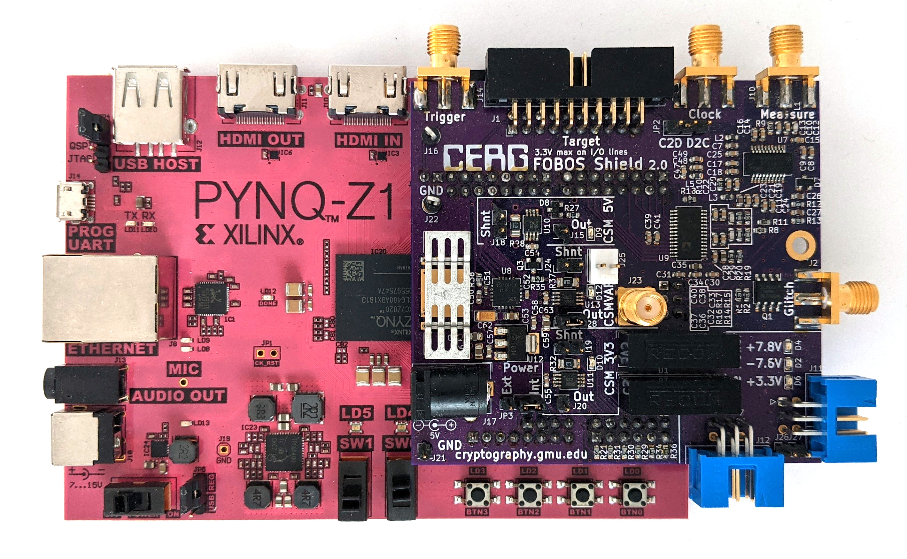

.. _control-setup-label:

*************
FOBOS Control
*************
FOBOS supports two boards for FOBOS Control:

#. Digilent Pynq-Z1
#. TUL Pynq-Z2

The support for the Digilent Basys 3 board has been discontinued as the Pynq boards are not only more 
powerful, they also allow faster communication with the SCA workstation.

The Pynq board can be augmented with the FOBOS Shield which has the following features:
    - Standard ChipWhisperer compatible DUT connector
    - DUT clock aligned measurements using built-in OpenADC
    - Power consumption measurements for benchmarking
    - Variable voltage output (0.9V - 3.5V)
    - Crowbar glitching
    - Isolated power supply for linear and differential amplifiers

.. toctree::
   :maxdepth: 1
   
   fobos-shield
   pynq-z1_shield
   pynq-z2_shield
   setup_pynq
   shield-calibration

   Pynq-Z1 with FOBOS Shield

