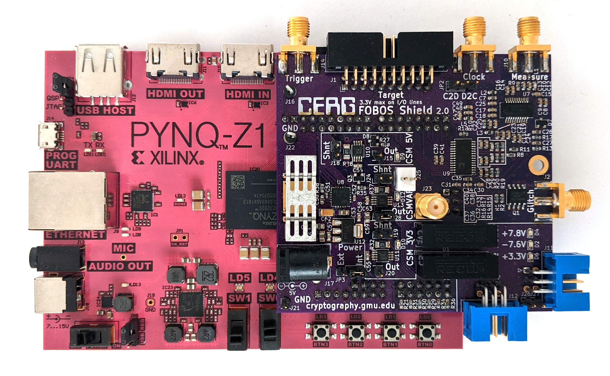

.. _control-setup-label:

*************
FOBOS Control
*************
FOBOS supports two boards for FOBOS Control:

#. Digilent Pynq-Z1
#. TUL Pynq-Z2

The support for the Digilent Basys 3 board has been discontinued as the Pynq boards are not only more 
powerfull, they also allow faster communication with the SCA workstation.

.. toctree::
   :maxdepth: 1
   
   pynq-z1_shield
   pynq-z2_shield
   setup_pynq
   shield-calibration

   Pynq-Z1 with FOBOS Shield

The main features are:

- Connected via gigabit Ethernet -> much faster communication to the SCA workstation
- Supports oscilloscope
- Supports FOBOS Shield which enables:
    - Standard ChipWhisperer compatible DUT connector
    - DUT clock aligned measurements using built-in OpenADC
    - Power consumption measurements for benchmarking
    - Variable voltage output (0.9V - 3.5V)
    - Crowbar glitching
    - Isolated power supply for linear and differential amplifiers

