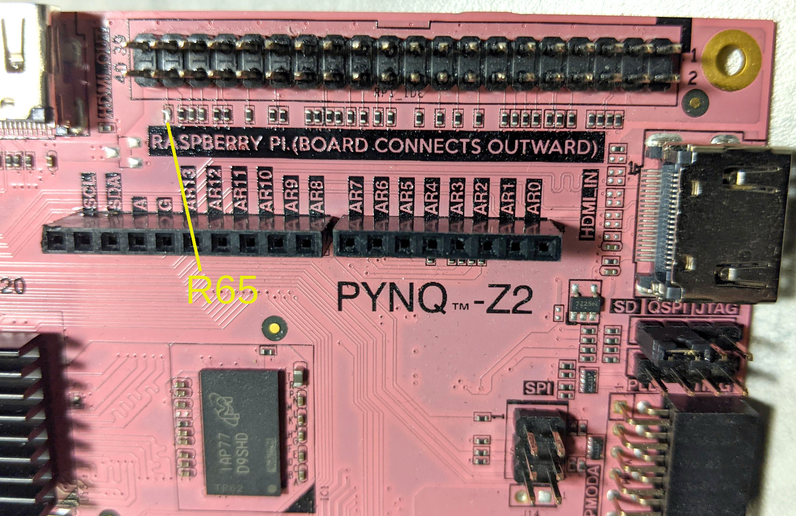
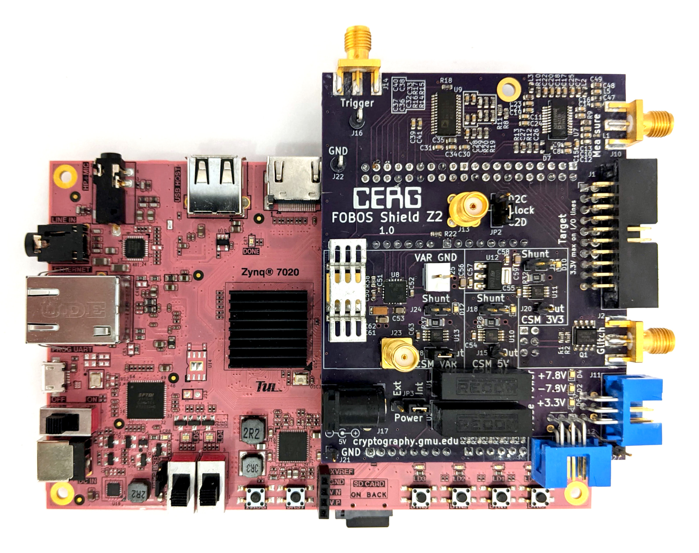

.. _control-pynqZ2-setup-label:

Pynq-Z2 Setup with FOBOS Shield
===============================
Below, we describe how to setup the FOBOS Shield with the Pynq-Z2 board. 

Modifying the Pynq-Z2 Board
---------------------------

    In order to use the FOBOS Shield, a small modification has to be made to the Pynq-Z2 board. 
    On the Pynq board, the 200 Ohm resistor R65 in the line RPIO_21_R to RP_IO15 of the ADC clock has to be 
    removed and replaced with a blob of solder or 0 Ohm resistor. The resistor attenuates the ADC clock signal too much.
    The board with the removed resistor is shown in (:numref:`fig_pynqZ2_modification`).

.. _fig_pynqZ2_modification:

   Modifications to Pynq-Z2 for FOBOS Shield

Attach the FOBOS Shield
-----------------------

    Carefully align the connectors of the FOBOS Shield with the Pynq-Z2 Arduino and Raspberry Pi headers and 
    firmly press down to securely connect the boards. The FOBOS Shield will sit right on-top of those connectors and 
    not connect outward as shown on the Pynq-Z2 board

.. _fig_pynqZ2_shield:

   Pynq-Z2 with FOBOS Shield

Connecting the Control Board
----------------------------

    You have two options to power the Pynq-Z2 board, either through USB or through an external 7V-15V DC power supply
    connected to the barrel connector DC IN. 

    If you choose to power the Pynq-Z2 board from USB, you have to set the jumper JP9 on the Pynq-Z2 board to ``USB``.
    The FOBOS shield requires more power than USB can supply, so you have to connect an external 
    well regulated 5V DC power supply to the FOBOS Shield J17 barrel connector and select ``EXT`` on 
    jumper JP3 on the shield. USB has only sufficient power for the Pynq board.

    If you choose to power the Pynq-Z2 board with an external power supply then the FOBOS Shield
    can be powered from the Pynz-Z2 board. Set the jumper JP9 on the Pynq-Z2 board to ``REG``. 
    Select ``INT`` on jumper JP3 on the FOBOS Shield.

    Connect the Pynq-Z2 board to your network with an Ethernet cable (CAT-5 or better for optimal performance).

    Only during installation, or if you choose to power the Pynq-Z2 board through USB, is the connection from 
    the SCA workstation to the Pynq-Z1 board via USB requiered.
    
    Power-up the boards using the power switch on the Pynq-Z2 board.
    

