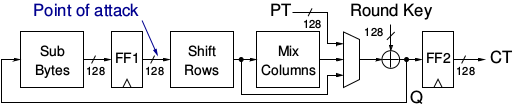

.. _AES_example:

===========
AES Example
===========

As part of FOBOS, we provide a simple AES-128 implementation in VHDL. The VHDL code for this AES implementation is 
provided in the directory ``dut/example_cores/AES-128``. The block diagram of this implementation is shown in 
:numref:`fig_AES-block`. 

.. _fig_AES-block:

   Block Diagram of the Example AES Implementation
