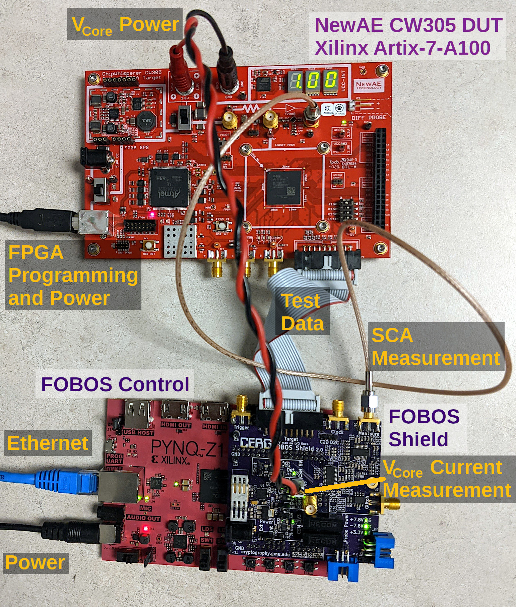

.. _dut_cw305-label:

=========================
NewAE CW305 (Artix7 FPGA)
=========================

Connection to FOBOS Shield control board
----------------------------------------

When using the FOBOS Shield, simply connect the 20pin ribbon cable to the target connector of the FOBOS Shield and the CW305. 
Connect an SMA cable to the SMA connector X4 of the CW305 board and to the Measure connector J10 on the FOBOS Shield or to an oscilloscope for measuring changes in power consumption for SCA measurement.

.. _fig_FOBOS-CW305:

   FODOS 3 Setup with NewAE CW305 DUT

Make sure to set the DUT to CW305 and DUT interface to INTERFACE_4BIT in your Jupyter notebook using the following commands.
This configures the FOBOS Control to DUT communication.

.. code-block:: py

    ctrl.setDUT(FOBOSCtrl.CW305)
    ctrl.setDUTInterface(FOBOSCtrl.INTERFACE_4BIT) 

When compiling the FOBOS wrapper, choose **cw305.xdc** as the constraint file.

Programming the CW305 DUT
-------------------------

You can program the DUT using the following commands in your Jupyter notebook:

.. code-block:: py

    from foboslib.dut import cw305dut as DUT
    dut = DUT.DUT()
    dut.setBitFile("crypto.bit")
    dut.program()

Power Measurement
-----------------

To measure the power consumption, you have to supply VCC-INT for the CW305 board from the FOBOS Shield. 
Connect the *Molex-Banana* cable to J25 on the Shield and the Banana sockets on the CW305 board as shown in :numref:`fig_FOBOS-CW305`.
Keep the source switch SW1 on the CW305 set to the internal power supply for now and switch on the CW305 board.

Enable the variable power supply on the FOBOS Shield and set it to supply 1.0V using the following command.

.. code-block:: py

    ctrl.pwSetVarOn(1.0)    

You can verify the voltage on this variable power supply with the following command.

.. code-block:: py

    ctrl.pwGetVoltVar()

Then you can change the source switch SW1 on the CW305 for the external power supply.
Verify immediately with the on board Voltage Meter of the CW305 that the Voltage for VCC-INT does not exceed 1.0V.
If it does, remove the banana plugs immediately.

.. warning:: 

    Do not apply a voltage greater than 1.0V to the banana jacks on the NewAE CW305 board or you might break the FPGA.

.. warning:: 

    Use the variable power supply of the FOBOS shield at your own risk! The FOBOS developers, the Cryptographic Engineering Research Group CERG, and George Mason University are not liable if using the variable power supply causes other circuits to fail. 
    FOBOS is provided on an "AS IS" BASIS, WITHOUT WARRANTIES OR CONDITIONS OF ANY KIND, either express or implied, including, without limitation, any warranties or conditions of TITLE, NON-INFRINGEMENT, MERCHANTABILITY, or FITNESS FOR A PARTICULAR PURPOSE. 

