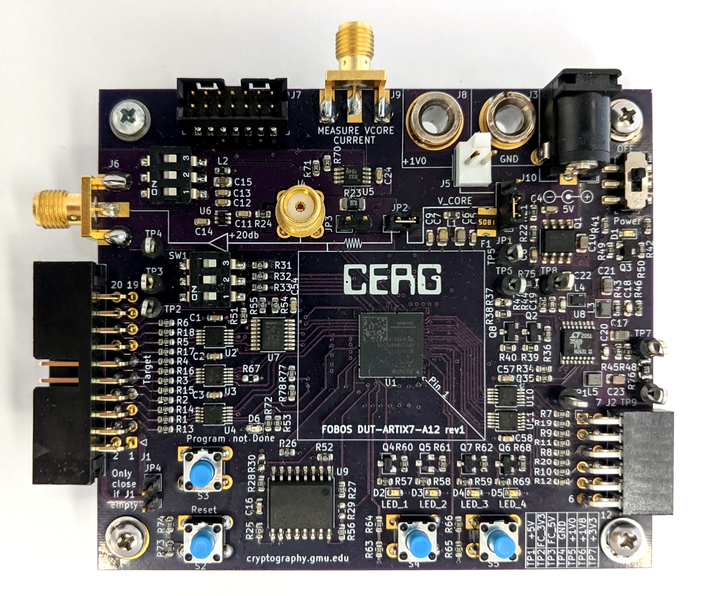
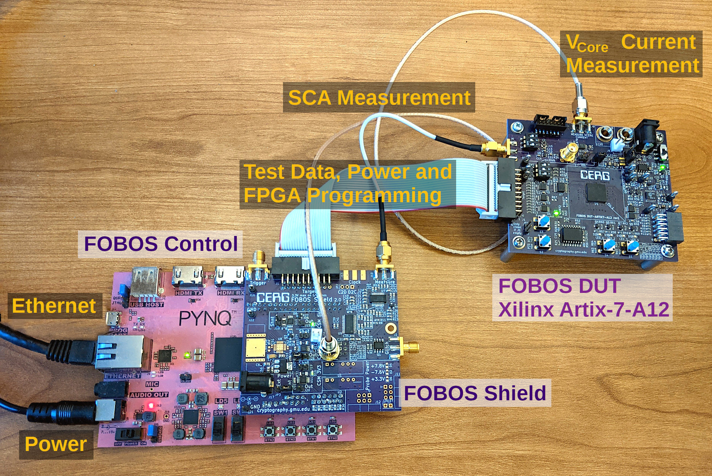
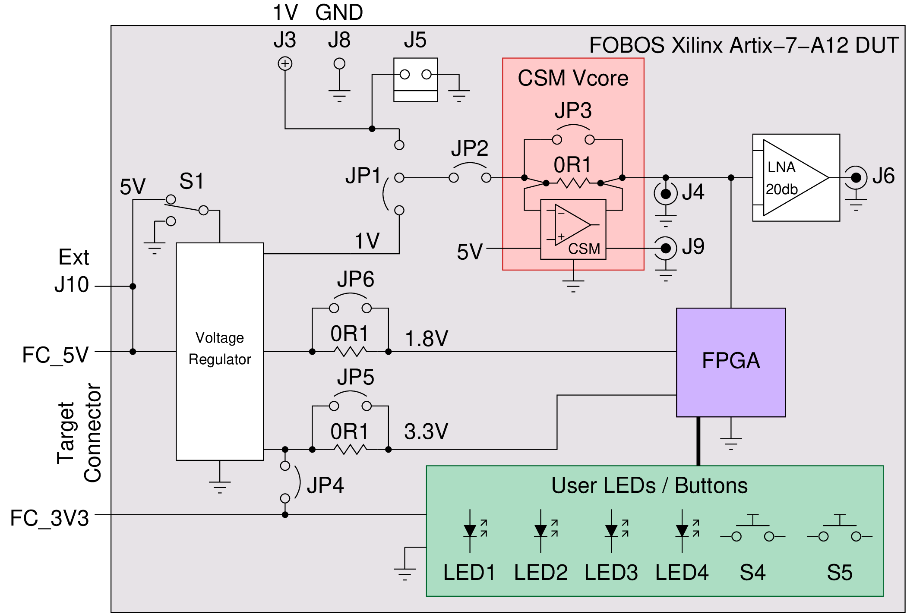

.. _dut_fbd-a7-label:

==========================
FOBOS FBD-A7 (Artix7 FPGA)
==========================

   FOBOS FBD-A7 DUT with Xilinx Artix-7-A12 FPGA

Connection to FOBOS Shield control board
----------------------------------------

When using the FOBOS Shield, simply connect the 20pin ribbon cable to the target connector of the FOBOS Shield and the FBD-A7. 
Connect an SMA cable to the SMA connector J6 of the FBD-A7 and to the Measure connector J10 on the FOBOS Shield or to an oscilloscope for measuring changes in power consumption for SCA measurement.

   FODOS 3 Setup with Artix7-A12 DUT

Make sure to set the DUT to FOBOS and DUT interface to INTERFACE_4BIT in your Jupyter notebook using the following commands.
This configures the FOBOS Control to DUT communication.

.. code-block:: py

    ctrl.setDUT(FOBOSCtrl.FOBOS)
    ctrl.setDUTInterface(FOBOSCtrl.INTERFACE_4BIT) 

When compiling the FOBOS wrapper, choose **fbd-a7.xdc** as the constraint file.

Implementing Cryptographic Algorithms for the FBD-A7 DUT
--------------------------------------------------------

Follow the instructions in :numref:`algorithm-implementation` and use the constraint file ``FOBOS_Artix7.xdc``.

Programming the FBD-A7 DUT
--------------------------

The DUT can only be programmed through the JTAG interface as of now. 
The capability to program the DUT directly from FOBOS Control or from the SPI flash is still being developed.

..
    You can program the DUT using the following commands in your Jupyter notebook:

    .. code-block:: py

        from foboslib.dut import fbd-a7 as DUT
        dut = DUT.DUT()
        dut.setBitFile("crypto.bit")
        dut.program()

Power Measurement
-----------------

To measure the power consumption, connect an SMA cable to the *Measure VCore Current* output J9 of the FBD-A7 and the CMS VAR alternate input J23 on the FOBOS Shield. Make sure that the jumper J28 on FOBOS Shield is pulled, see :numref:`fig_power_circuit`.

.. _fig_FBD-A7_power:

   FBD-A7 Power Block Diagram
