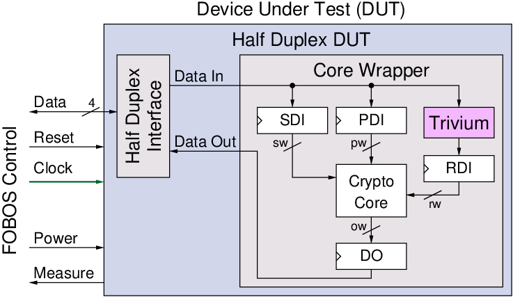

.. _fobos-dut-comms:

=======================
FOBOS DUT Communication
=======================
Test vectors are sent form PC one at a time to the control board which stores them briefly.
The control board starts sending the test vector to the DUT board through the FOBOS DUT interface.
The DUT wrapper then puts data in the correct FIFOs (PDI, SDI and RDI).
Once the DUT wrapper receives the start command from the controller, it de-asserts the function core reset signal and the function core will run and consume the data in the FIFOs. 
The output of the function core is stored in the DO fifo. 
Once the DO FIFO accumulates EXPECTED_OUTPUT bytes, the DUT wrapper will send this data to the control board which forwards it to the PC.

.. _dut-fobos_wrapper:

=============
FOBOS Wrapper
=============

The FOBOS wrapper provides translation from the FOBOS DUT interface to the Crypto Core Interface which is 
compatible with the GMU LWC Hardware API interface as described in :numref:`lwc_hw_api`.
A simplified block diagram 
of the FOBOS wrapper is shown in :numref:`fig_dut-block`. The 20-pin FOBOS target connector uses a 4-bit bidirectional 
data bus with FIFO style handshaking. Therefor, the top-level VHDL file of the wrapper is called ``half_duplex_dut.vhd``. 
It uses the ``half_duplex_interface.vhd`` to convert this into a 4-bit full duplex interface which connects to the 
``core_wrapper.vhd``. Inside the Core Wrapper, the user can port map their GMU LWC Hardware API conforming implementation.

.. _fig_dut-block:

   Block Diagram of FOBOS Wrapper for the DUT

The Public Data Input (PDI), Secret Data Input (SDI), Random Data Input (RDI) and Data Output (DO) use First Word Fall-Through (FWFT) 
FIFOs called FIFO_0, FIFO_1, FIFO_OUT, and FIFO_RDI respectively. Their widths and depths can be set in the file 
``core_wrapper_pkg.vhdl``. Random data is provided by the Trivium stream cipher which can be seeded. 
For the sake of simplicity, :numref:`fig_dut-block` does not show the registers and control logic required for the 
FOBOS DUT Protocol or any required Parallel Input Serial Output (PISO) or Serial Input Parallel Output (SIPO) converters.

The VHDL code for the FOBOS Wrapper, including PISO, SIPO, FWFT FIFOs, and Trivium is provided in the directory
``dut/fpga_wrapper/src_rtl``.

=====================
Crypto Core Interface
=====================

The interface follows a simple AXI stream protocol. The 'valid' signals indicates data from source are valid and 'ready' signals 
indicates destination is ready to use data. When both 'valid' and 'ready' signals are set to logic 1, data is transferred.
All the data signals shown in the listing below, are connected to the FIFOs PDI, SDI, RDI and DO.

The function core (victim) is instantiated as follows in the ``core_wrapper.vhd`` file around line 173.
The example below shows how to instantiate the unprotected implementation of AES that is supplied as an 
example.

.. code-block:: vhdl

    --=============================================
    -- BEGING USER CRYPTO  
    -- Instantiate your core here
    crypto_core : entity work.aes_axi(behav)
    port map(
    	clk         => clk,
    	rst         => not crypto_input_en,
        -- data signals
    	pdi_data    => crypto_di0_data,
    	pdi_valid   => crypto_di0_valid,
    	pdi_ready   => crypto_di0_ready,

        sdi_data    => crypto_di1_data,
    	sdi_valid   => crypto_di1_valid,
    	sdi_ready   => crypto_di1_ready,

    	do_data     => crypto_do_data,
    	do_ready    => crypto_do_ready,
    	do_valid    => crypto_do_valid

        --! if rdi_interface for side-channel protected versions is required, uncomment the rdi interface
        -- ,rdi_data => crypto_rdi_data,
        -- rdi_ready => crypto_rdi_ready,
        -- rdi_valid => crypto_rdi_valid
    );
    -- END USER CRYPTO
    --=============================================

The widths *pw* of PDI "FIFO_0", *sw* of SDI "FIFO_1", *ow* of DO "FIFO_OUT", and *rw* of RDI "FIFO_RDI" 
as well as their depth in words of WIDTH bits has to be defined in ``core_wrapper_pkg.vhd`` which is shown 
below.

.. code-block:: vhdl

    package core_wrapper_pkg is
        -- input fifos
        constant FIFO_0_WIDTH           : natural := 128    ;
        constant FIFO_0_LOG2DEPTH       : natural := 1      ;
        constant FIFO_1_WIDTH           : natural := 128    ;
        constant FIFO_1_LOG2DEPTH       : natural := 1      ;
        -- output fifo
        constant FIFO_OUT_WIDTH         : natural := 128    ;    
        constant FIFO_OUT_LOG2DEPTH     : natural := 1      ;
        -- random data
        constant RAND_WORDS             : natural := 8      ;
        constant FIFO_RDI_WIDTH         : natural := 64     ;
        constant FIFO_RDI_LOG2DEPTH     : natural := 3      ;  
    
    end core_wrapper_pkg;

It is highly recommended that the DUT is tested using the ``dut/fpga_wrapper/src_tb/core_wrapper_tb.vhd`` test bench and ensure 
that the output is valid. 
This testbench needs one test vector to be stored in the file dinFile.txt and generates doutFile.txt output file.

