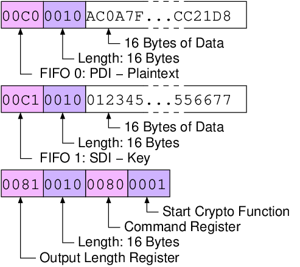

.. _dut-fobos_wrapper:

=============
FOBOS Wrapper
=============

The FOBOS wrapper provides translation from the FOBOS DUT protocol to the GMU LWC Hardware API. A simplified block diagram 
of the FOBOS wrapper is shown in :numref:`fig_dut-block`. The 20-pin FOBOS target connector uses a 4-bit bidirectional 
data bus with FIFO style handshaking. Therefor, the top-level VHDL file of the wrapper is called ``half_duplex_dut.vhd``. 
It uses the ``half_duplex_interface.vhd`` to convert this into a 4-bit full duplex interface which connects to the 
``core_wrapper.vhd``. Inside the Core Wrapper, the user can port map their GMU LWC Hardware API conforming implementation.

.. _fig_dut-block:
.. figure::  ../figures/dut-block.png
   :align:   center
   :height: 350 px

   Block Diagram of FOBOS Wrapper for the DUT

The Public Data Input (PDI), Secret Data Input (SDI), Random Data Input (RDI) and Data Output (DO) use First Word Fall-Through (FWFT) 
FIFOs called FIFO_0, FIFO_1, FIFO_OUT, and FIFO_RDI respectively. Their widths and depths can be set in the file 
``core_wrapper_pkg.vhdl``. Random data is provided by the Trivium stream cipher which can be seeded. 
For the sake of simplicity, :numref:`fig_dut-block` does not show the registers and control logic required for the 
FOBOS DUT Protocol or any required Parallel Input Serial Output (PISO) or Serial Input Parallel Output (SIPO) converters.

The VHDL code for the FOBOS Wrapper, including PISO, SIPO, FWFT FIFOs, and Trivium is provided in the directory
``dut/fpga_wrapper/src_rtl``.

==================
FOBOS DUT Protocol
==================

.. _fig_dut-protocol:
.. figure::  ../figures/dut-protocol.png
   :align:   center
   :height: 100 px

   FOBOS DUT Protocol

FOBOS uses the simple protocol shown in :numref:`fig_dut-protocol`. 
An instruction consists of an Opcode and a Destination.
The Opcode describes in which type of storage should be used. 
A **C** indicates a FIFO, an **8** a 32-bit register. This is immediately followed by the Destination, i.e., the 
FIFO or register number. Each instruction is followed by a Parameter. In case of FIFO, the parameter contains the 
number of bytes of data following. In case of Register, it contains the data to be stored in the selected register.
:numref:`tab_dut-protocol_instructions` shows the implemented Instructions and the purpose of the associated 
Parameters.

.. _tab_dut-protocol_instructions:
.. table:: FOBOS DUT Protocol Instructions

    +--------+-------------+-------------+---------+---------------------------------------+
    | Opcode | Destination | Storage     | Usage   | Parameter                             |
    +========+=============+=============+=========+=======================================+
    | C      | 0           | FIFO_0      | PDI     | length of data in bytes               |
    +--------+-------------+-------------+---------+---------------------------------------+
    | C      | 1           | FIFO_1      | SDI     | length of data in bytes               |
    +--------+-------------+-------------+---------+---------------------------------------+
    | 8      | 0           | Register 0  | cmd     | Command                               |
    +--------+-------------+-------------+---------+---------------------------------------+
    | 8      | 1           | Register 1  | outlen  | length of output in bytes             |
    +--------+-------------+-------------+---------+---------------------------------------+
    | 8      | 2           | Register 2  | rndlen  | length of random data in 32-bit words |
    +--------+-------------+-------------+---------+---------------------------------------+
    | 8      | 3           | Register 3  |         |                                       |
    +--------+-------------+-------------+---------+---------------------------------------+
    | 8      | 4           | Register 4  | seed0   | Part of seed for RNG                  |
    +--------+-------------+-------------+---------+---------------------------------------+
    | 8      | 5           | Register 5  | seed1   | Part of seed for RNG                  |
    +--------+-------------+-------------+---------+---------------------------------------+
    | 8      | 6           | Register 6  | seed2   | Part of seed for RNG                  |
    +--------+-------------+-------------+---------+---------------------------------------+
    | 8      | 7           | Register 7  | seed3   | Part of seed for RNG                  |
    +--------+-------------+-------------+---------+---------------------------------------+

The FOBOS DUT Protocol implements two commands:

1. Start the cryptographic operation.
2. Generate *rndlen* 32-bit words of random data and put them into the RDI FIFO.

:numref:`fig_testvector` shows an example of a test vector for a block cipher. First 128-bit (16 Bytes) of plaintext are 
send for FIFO-0, then 128-bit (16 Bytes) of key for FIFO-2, followed by the expected cyphertext length 
of 128-bit (16 Bytes) and the command to start encryption.

.. _fig_testvector:

   FOBOS Block Cipher Test Vector

