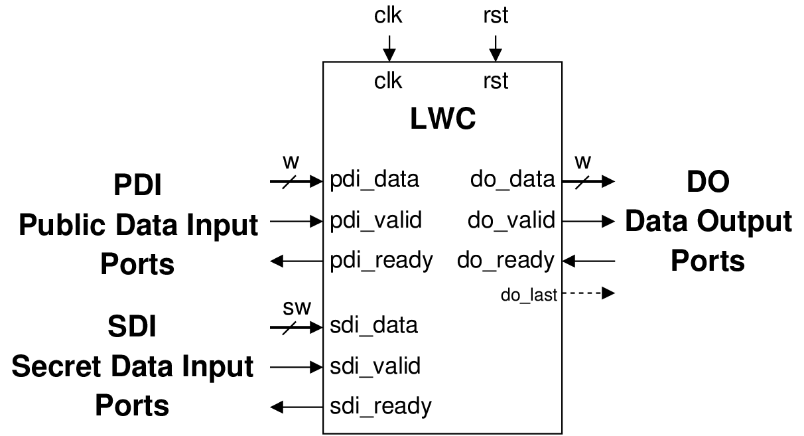
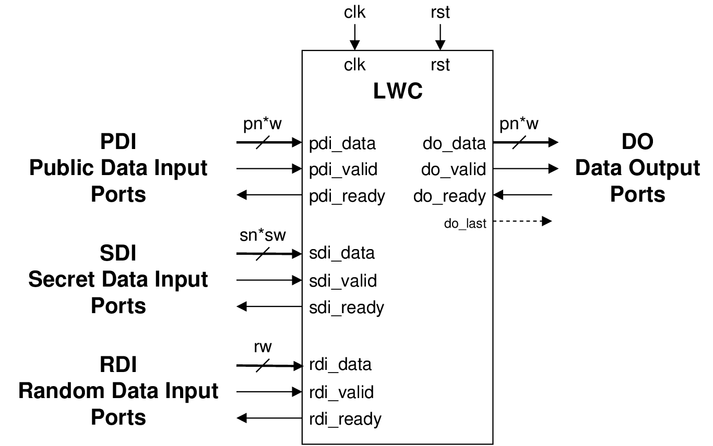

.. _lwc_hw_api:

====================
GMU LWC Hardware API
====================

The GMU `Hardware API for Lightweight Cryptography <https://cryptography.gmu.edu/athena/LWC/LWC_HW_API_v1_1.pdf>`_ was 
created to assure the fairness of benchmarking and compatibility among implementations of the same 
algorithm by different designers. The major parts of this API include the minimum compliance criteria, interface, 
communication protocol, and timing characteristics supported by the implemented core.
The API supports  hardware cores implementing an
authenticated cipher, a hash function, or both functionalities. Since 2016,
a similar API has been successfully used to implement and benchmark
all candidates qualified to Rounds 2 and 3 of the CAESAR competition
for authenticated ciphers.

The interface of the LWC API is shown in :numref:`fig_lwc-interface` for single-pass algorithms and in 
:numref:`fig_lwc-interface-sca` for SCA-protected implementations of single-pass algorithms.

.. _fig_lwc-interface:

   LWC interface for single-pass algorithms

This interface includes three major data buses for:

* Public Data Inputs (PDI)
* Secret Data Inputs (SDI), and
* Data Outputs (DO),

as well as the corresponding handshaking control signals, named valid and ready.
The valid signal indicates that the data is ready at the source, and the ready
signal indicates that the destination is ready to receive it. The signal do_last is
an optional signal.

.. _fig_lwc-interface-sca:

   LWC interface SCA-protected implementations for single-pass algorithms

The extended interface supporting protected implementations is shown in
:numref:`lwc-interface-sca`. In unprotected implementations, the public data input PDI accepts
data of size w bits. For protected implementations, this input was modified, so
it accepts pn shares of size w bits in parallel. The same holds for the data output
DO, which now provides pn shares of size w. The number of shares on the secret
data input SDI is denoted as sn, as it can differ from the number of shares on
PDI.

To facilitate side-channel resistant implementations that require fresh randomness, 
an additional Random Data Input (RDI) bus was added, comprised of the signals rdi_data 
of the user selectable width rw bits, rdi_ready and rdi_valid.
The RDI ports, just like all the others, follow a simple FIFO protocol. Each
read will provide rw bits.

This interface implies that a deterministic random bit generator (DRBG)
used as a source of fresh randomness is located outside of the protected LWC
core. This way, resource utilization and power consumption of this DRBG can
be excluded from the results generated during benchmarking.

