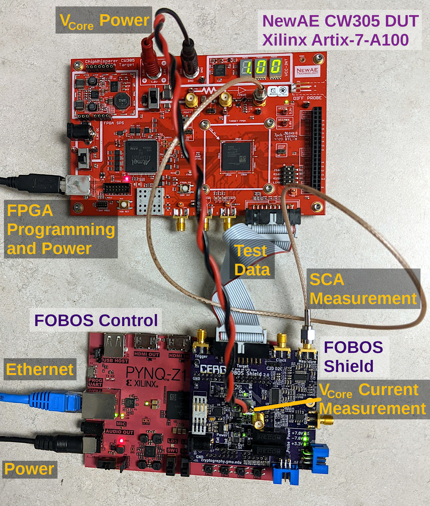

.. FOBOS documentation master file, created by
   sphinx-quickstart on Fri Aug 30 16:09:53 2019.
   You can adapt this file completely to your liking, but it should at least
   contain the root `toctree` directive.

Flexible Opensource workBench fOr Side-channel analysis (FOBOS)
***************************************************************

The Flexible Opensource workBench fOr Side-channel analysis FOBOS is a platform to perform side-channel analysis (SCA).
FOBOS uses commercially avilable boards when possible to reduce the cost of building a working SCA setup.
Using FOBOS, power traces can be collected and attacks like Correlation Power Analysis (CPA) can be mounted.
Also, scripts to perform leakage assesment are included.

   FOBOS 3 Setup with NewAE CW305 DUT

Features
========

- Runs cryptographic implementations on FPGAs and measures power consumption.
- Provides a simple wrapper for FPGA implementations of cryptographic algorithms 
  according to the CAESAR and LWC Hardware APIs.
- Separate control and DUT boards allowing easy addition of new DUTs.
- Uses commercial over-the-shelf boards when possible to reduce cost.
- Digilent Basys3 and Digilent Pynq-Z1 control boards.
- DUT support includes Digilent Nexys3 board (Xilinx Spartan6) and NewAE CW305
  (Xilinx Artix7 boards).
- Adjustable DUT clock.
- DUT clock synchronized with ADC clock.
- Adjustable trigger signal.
- Supports fast USB3-based oscilloscopes (Picoscope).
- Software to perform Correlation Power Analysis (CPA).
- Leakage assessment using t-test. 

.. toctree::
   :maxdepth: 3
   :numbered:
   :hidden:
   
   introduction
   workstation/index
   controller/index
   dut/index
   modules/index
   tvgen/index
   examples/index
   teaching/index
   api/modules
   reference_doc
   license
   bibliography

.. Download Document
    =================
    
    * `FOBOS 3 User Guide <https://cryptography.gmu.edu/download.php?docid=2616>`_ in PDF format, please cite as [`Bibtex <https://cryptography.gmu.edu/bibtex.php?id=2616>`_]
  
Index
=====

* :ref:`genindex`

.. * :ref:`search`
