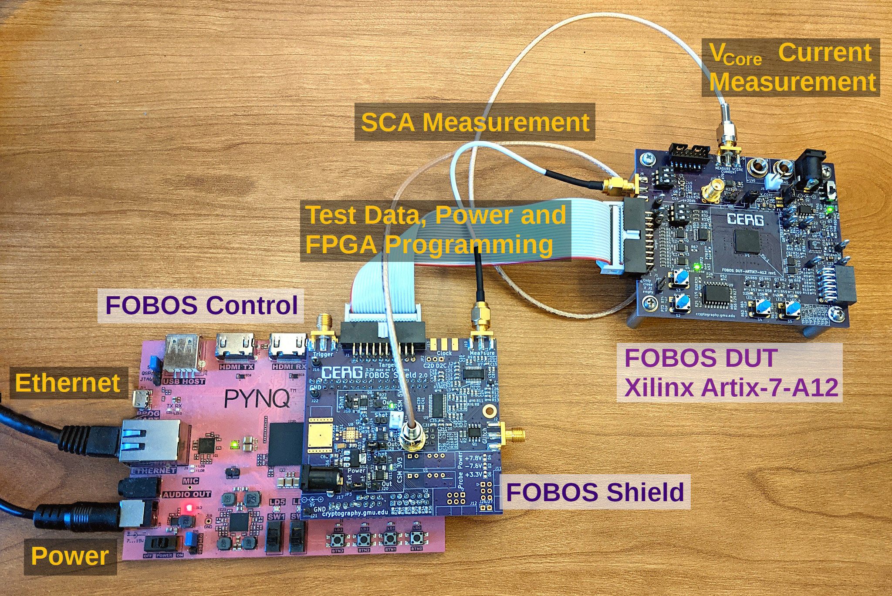

Introduction
************
The Flexible Opensource workBench fOr Sidechannel analysis (FOBOS) 
loosely named after the Greek god Phobos (Φóβος), is an "acquisition to analysis" 
solution which includes all necessary software to control the Device Under Test (DUT), 
obtain the measurements and analyze them using several power analysis techniques. 
FOBOS mainly targets FPGAs as DUTs. 
The system is targeted for educational and research purposes.

   FODOS 3 Setup with Artix7-A12 DUT

FOBOS Overview
==============
The main components of the FOBOS 3 platform are as follows:

1. The *SCA Workstation* hosts capture and analysis scripts using a 
   JupyterLab installation. All scripts are written in Python and are 
   commented and easy to modify. In typical system usage, the user runs capture 
   scripts that send test vectors (e.g., key and plaintext) one at a time to 
   the connected control board and receives the results (e.g., ciphertext) 
   and power traces. Analysis scripts can be run on the saved results and traces 
   or optionally executed simultaneously with trace collection.
2. The *control board* receives a test vector from the SCA workstation and forwards 
   it to the DUT. The control board asserts a trigger signal as
   soon as the target board starts operating on the test vector (i.e., running
   the cryptographic function). This signal can trigger an external oscilloscope
   or the internal ADC hosted on the FOBOS Shield. The control board also generates 
   the target clock. The internal ADC can sample changes in the power consumption 
   of the target board at a maximum rate of 100 M Sample/sec. The sampling clock and the target
   clocks are synchronized to achieve high-precision measurements.
3. The *DUT* hosts the cryptographic function that is being evaluated.
   The DUT board is designed (or modified) to allow measurement of the power
   consumption using a shunt resistor or a current probe. We tested the platform 
   using a modified Digilent Nexys 3 board featuring a Xilinx Spartan-6
   FPGA, the NewAE CW305 Artix-7 target board, and our upcoming FOBOS Artix-7-based DUT.

Feature Overview
================

- Runs cryptographic implementations on FPGAs and measures power consumption.
- Provides a simple wrapper for FPGA implementations of cryptographic algorithms 
  according to the CAESAR and LWC Hardware APIs.
- Separate control and DUT boards allowing easy addition of new DUTs.
- Uses commercial over-the-shelf boards when possible to reduce cost.
- Digilent Pynq-Z1 and TUL Pynq-Z2 control boards.
- DUT support includes Digilent Nexys3 board (Xilinx Spartan6), FOBOS FBD-A7 and NewAE CW305
  (Xilinx Artix7 boards).
- Adjustable DUT clock.
- DUT clock synchronized with ADC clock.
- Adjustable trigger signal.
- Supports fast USB3-based oscilloscopes (Picoscope).
- Software to perform Correlation Power Analysis (CPA).
- Leakage assessment using t-test. 

Changelog
=========

**Version 3.0.1**

- Substantial documentation updates and improvements
- Power calibration works again (was working on beta versions of FOBOS 3)
- MTDs of each key byte are now written into a file, they don't have to be guessed from graphs anymore
- Updated fobosTVGen to handle more FIFOs
- XILINX_XRT environment variable on Pynq was not set correctly
- Pynq install script now detects which Pynq board it is running on
- FOBOS can now set fixed amplification on the amplifier of the FOBOS Shield using ADC_hilo
- Improved Makefile for building the Pynq overlay for Pynq-Z1 and Pynq-Z2, and different revisions of the FOBOS Shield

**Version 3**

- Completely new version of FOBOS with major changes
- FOBOS Shield which provides 100 MS/s ADC for SCA measurements and current sense monitors
  for power consumption measurements. This removes the need for an oscilloscope and 
  enables benchmarking of power and energy consumption of the DUT.
- Digilent Pynq-Z1 and TUL Pynq-Z2 control boards provide fast data aquisition and communication with the 
  DUT through 1G Ethernet interface.
- JupyterLab front end to control FOBOS. This also enables remote access.

