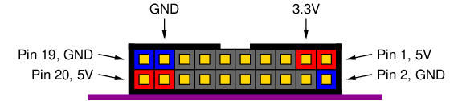

.. _dut_comms-label:

DUT Communication Module
************************

This module controls the communication with the Device Under Test (DUT) and determines 
from the handshaking lines what the state of the DUT is.

.. _dut_interface-label:

DUT Interface
=============

The DUT interface consists of reset, clock, data, and handshaking signals. The FOBOS Shield can 
also provide power to the DUT. All signal names start with the letter **F** for FOBOS. The 
next letter tells where the signal originates: **C** for control board, **D** for DUT.
Bidirectional signals always get a **C**. For example **FC_RST** is a reset signal that gets send by 
the control board; **FD2C_HS** is a handshaking signal that goes from the DUT to the control board.

Pynq Controller with FOBOS Shield
---------------------------------

The FOBOS Shield provides a FOBOS target connector which is compatible to the 
ChipWhisperer target connector. 
The FOBOS target connector is shown in :numref:`fig_target_connector` and the pin-out is 
described in :numref:`tab_target_connector`. LOC is the FPGA pin name. 
This is a 4-bit half-duplex FIFO interface.

.. _fig_target_connector:

   FOBOS target connector viewed from front

.. _tab_target_connector:
.. table:: FOBOS target connector Pinout

   +--------+--------+----------+-----------+----------------------------+
   | Pin    | LOC    | Net      | CW Name   | Comment                    |
   +========+========+==========+===========+============================+
   |  1     |        | FC_5V    |           | 5V Supply                  |
   +--------+--------+----------+-----------+----------------------------+
   |  2     |        | GND      |           |                            |
   +--------+--------+----------+-----------+----------------------------+
   |  3     |        | FC_3V3   |           | 3.3V Supply                |
   +--------+--------+----------+-----------+----------------------------+
   |  4     | U7     | FD2C_CLK | CS_HS1    | Clock from DUT to Control  |
   +--------+--------+----------+-----------+----------------------------+
   |  5     | T14    | FC_RST   | CW_RST    | DUT Reset                  |
   +--------+--------+----------+-----------+----------------------------+
   |  6     | Y7     | FC2D_CLK | CS_HS2    | Clock from Control to DUT  |
   +--------+--------+----------+-----------+----------------------------+
   |  7     | U5     | FC_IO    | CW_MISO   | Direction of Bus           |
   +--------+--------+----------+-----------+----------------------------+
   |  8     |        | FD_VREF  |           | IO Voltage of DUT          |
   +--------+--------+----------+-----------+----------------------------+
   |  9     | V5     | FD_TF    | CW_MOSI   | DUT Busy                   |
   +--------+--------+----------+-----------+----------------------------+
   | 10     | U12    | FC_DIO0  | CW_TARG1  | Data Bus bit 0             |
   +--------+--------+----------+-----------+----------------------------+
   | 11     | V6     | FC2D_HS  | CW_SCK    | Control to DUT Handshaking |
   +--------+--------+----------+-----------+----------------------------+
   | 12     | U12    | FC_DIO1  | CW_TARG2  | Data Bus bit 1             |
   +--------+--------+----------+-----------+----------------------------+
   | 13     | V15    | FD2C_HS  | CW_PDIC   | DUT to Control Handshaking |
   +--------+--------+----------+-----------+----------------------------+
   | 14     | U12    | FC_DIO2  | CW_TARG3  | Data Bus bit 2             |
   +--------+--------+----------+-----------+----------------------------+
   | 15     | T15    | FC_PROG  | CW_PDID   | DUT Programing             |
   +--------+--------+----------+-----------+----------------------------+
   | 16     | U12    | FC_DIO3  | CW_TARG4  | Data Bus bit 3             |
   +--------+--------+----------+-----------+----------------------------+
   | 17     |        | GND      |           |                            |
   +--------+--------+----------+-----------+----------------------------+
   | 18     |        | FC_3V3   |           | 3.3V Supply                |
   +--------+--------+----------+-----------+----------------------------+
   | 19     |        | GND      |           |                            |
   +--------+--------+----------+-----------+----------------------------+
   | 20     |        | FC_5V    |           | 5V Supply                  |
   +--------+--------+----------+-----------+----------------------------+

Setting DUT Interface
=====================

FOBOS supports a 4-bit full-duplex FIFO interface when using PMOD connectors and a 
4-bit half-duplex FIFO interface when using the target connector on the FOBOS Shield.
The selections are:

- INTERFACE_4BIT: 4-bit half-duplex FIFO interface using the target connector on the FOBOS Shield
- INTERFACE_8BIT: 4-bit full-duplex FIFO interface using PMOD connectors

.. code-block:: py

    ctrl.setDUTInterface(FOBOSCtrl.Value)

Output Length
=============

FOBOS has to know how may output **Bytes** it has to expect from the DUT. 
This is used to generate the tlast signal used to mark the end of the packet.

.. code-block:: py

    ctrl.setOutLen(Value)

