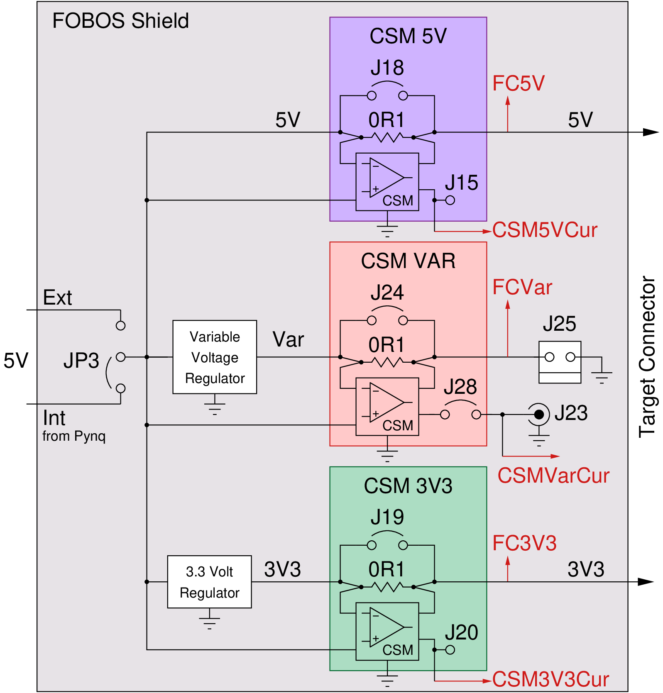

.. _power-label:

Power Module
************

The power module requires the FOBOS Shield. It contains three power supplies:

- Fixed, unregulated 5V power supply (FC_5V), up to 1A
- Fixed, regulated 3.3V power supply (FC_3V3), up to 800mA
- Variable supply (FC_VAR), programmable from 0.9V to 3.5V in 0.05V increments, up to 1A

The circuit of these power supplies is shown in (:numref:`fig_power_circuit`).

.. _fig_power_circuit:

   Block Diagram of FOBOS Shield Power Circuitry

.. _power_pynq-label:

Powering Pynq and FOBOS Shield
==============================

The Pynq equipped with the FOBOS Shield has to be powered with a power supply, not through the USB port. This combination will 
draw more power than the Pynq's USB port can provide. There are two options to provide
this power:

#.  External power for the Pynq

    -   In this configuration, the external power supply powers both, the Pynq and the FOBOS Shield power module.
    -   Connect a 7V-15V, 2A-3A power supply to the Pynq to the power jack (J18) of the Pynq-Z1.  
        The supply must use a center-positive 2.1mm barrel plug.
    -   Set the jumper JP5 on the Pynq-Z1 to "REG". 
    -   Set the jumper JP3 on the FOBOS Shield to "Int".

    .. warning:: 

        In this configuration, not more than a total of 1A should be drawn across all three power 
        supplies of the shield or the 5V regulator of the Pynq will be overloaded.

#.  External power of the FOBOS Shield

    -   In this configuration, the external power supply powers only the FOBOS Shield power module.
    -   Connect a **well regulated** 5V, 2A-3A power supply to the power jack (J17) of FOBOS Shield.  
        The supply must use a center-positive 2.1mm barrel plug.
    -   Set the jumper JP3 on the FOBOS Shield to "Int".

    .. warning::

        In this configuration, the 5V power supply (FC_5V) is not regulated and the actual voltage 
        depends solely on the external supply.

Power Module Specifications
============================

The `Xilinx XADC <https://docs.xilinx.com/r/en-US/ug480_7Series_XADC/XADC-Overview>`_ on the Pynq board is used to sample from the voltage and current supplies. The XADC has a precision of 12-bits and can sample at up to 1 MSample/s, however in this design the XADC is used to measure seven channels. Thus the effective sampling rate for any individial channel is ~143 KSample/s.

If a higher sample rate is desired, it is possible to use an external oscilloscope to measure the current through the variable voltage supply. To do so, simply close the J28 jumper and connect the oscilloscope to the J23 BNC connector. This enables direct measurement of the CSM voltage which can be used to calculate the current being used.

There is a script for calibrating the voltage and current measurements, which is described in :numref:`power-calibration`.

Using the Variable Power Supply
===============================

The variably power supply can be programmed to deliver voltages from 0.9V to 3.5V in 0.05V increments. The following commands set the voltage and switches the power supply on, changes the voltage to a new value, and then switches the power supply off again.

.. code-block:: py

    ctrl.pwSetVarOn(1.0)    
    ctrl.pwOutVarSet(1.15)
    ctrl.pwSetVarOff()    

Measuring Power Supply Voltage
==============================

FOBOS uses the XADC of the Zynq SOC on the Pynq to measure the voltages of the three power supplies. 
The instantaneous voltage for any power supply can be accessed with the following commands:

.. code-block:: py

    ctrl.pwGetVolt5v()
    ctrl.pwGetVoltVar()
    ctrl.pwGetVolt3v3()

Measuring Power Supply Current
==============================

The power consumed by a device can be computed from the current *I* that it draws and
its supply voltage *V* as :math:`P = I \cdot V`. The energy it 
consumes for executing a particular task is the integral of *P* over the run time.
FOBOS measures both, the current that gets drawn from each power supply line and 
the voltage that is actually supplied.

The current is measured by sensing the voltage drop across a 0.1 :math:`\Omega`
shunt resistor *R*.
The shunt resistor could be placed between the voltage source and the device
or between the device and ground called high-side and low-side current sensing
respectively. We opted for high-side current sensing (:numref:`fig_power_circuit`)
as it eliminates the problems associated with multiple ground paths. 
The drawback of high-side sensing is the higher common-mode voltage which is the
average voltage before and after the shunt. 

The shunt resistor should be very small as to not have a large influence on 
the supply voltage, however that means that voltage drop across the shunt will
also be very small. Therefore, it has to be amplified before it can be measured by 
an analog to digital converter (ADC). Furthermore, the low input resistance
of ADCs makes a direct measurement unfeasible.  
Hence, we use a current-shunt monitor (CSM), i.e. the INA225 from Texas Instruments.
It has a programmable gain setting of 25, 50, 100, and 200, a buffered output so that it
can drive an ADC input, a bandwidth of 125 kHz, and supports high common-mode voltages.

The formula for the resolution of the ADC is shown in :eq:`eq_adcres`. The maximum input voltage
to the XADC (:math:`V_{CSMmax}`) via FOBOS Shield is 5V and its resolution is 12 bits. 

.. math::
    :label: eq_adcres

    V_{res}=\frac{V_{CSMmax}}{2^{ADCbits}} = \frac{5\,\mathrm{V}}{2^{12}\,\mathrm{bits}} = 1.22\,\mathrm{mV}

The voltage applied to the ADC depends on the voltage drop :math:`V_S` across the shunt resistor
:math:`R_S` and the gain of the CSM :math:`\delta_{CSM}`. This relationship is expressed in :eq:`eq_csm`.

.. math::
    :label: eq_csm

    V_{CSM} = V_S \cdot \delta_{CSM} = R_S \cdot I \cdot \delta_{CSM}

We are using a :math:`0.1\,\Omega` resistor for :math:`R_S` and achieve for a gain factor of 25 a resolution of

.. math::

    I_{res} = \frac{V_{res}}{R_S \cdot \delta_{CSM}} = \frac{1.22\,\mathrm{mV}}{0.1\,\Omega \cdot 25} = 488\,\mathrm{\mu A}

and can measure a current of at most

.. math::

    I_{max} = \frac{V_{CSMmax}}{R_S \cdot \delta_{CSM}} = \frac{5\,\mathrm{V}}{0.1\,\Omega \cdot 25} = 2\,\mathrm{A}.

At the maximum gain of 200 the resolution is :math:`61.0\,\mathrm{\mu A}` and the maximum current is :math:`250.0\,mA`.

FOBOS uses the XADC of the Zynq SOC on the Pynq to measure the voltages from the CSMs of the three power supplies and 
converts them, while taking the gain factors into account, to the corresponding currents.
The instantaneous current can be accessed with the following commands:

.. important:: 
    In order to be able to measure the current of the variable power supply (FC_VAR), the jumper J28 on the 
    FOBOS Shield has to be closed (see :numref:`fig_power_circuit`).

.. code-block:: py

    ctrl.pwGetCurr5v()
    ctrl.pwGetCurrVar()
    ctrl.pwGetCurr3v3()

The gain of the CSMs is set to 25 by default. If a larger gain is required, it can be changed for each CSM separately using
the following commands. The *Value* can be one of 25, 50, 100, 200.

.. code-block:: py

    ctrl.pwSetGain5v()
    ctrl.pwSetGainVar()
    ctrl.pwSetGain3v3()

The current value of the CSM gain can be queried using these commands:

.. code-block:: py

    ctrl.pwGetGain5v()
    ctrl.pwGetGainVar()
    ctrl.pwGetGain3v3()

Hardware and Software Trigger
=============================

FOBOS is capable to determine the maximum and average current consumed and voltage supplied to the 
DUT during a specified time period.

The *software trigger* can be used to start and stop this time period using the following Python 
commands:

.. code-block:: py

    ctrl.pwSetSwTrig()         # starts the measurement
    ctrl.pwCheckSwTrigStatus() # checks if software trigger was active
    ctrl.pwUnsetSwTrig()       # stops the measurement NOT IMPLEMENTED! 

This measurement window can be easily synchronized with the operation of the DUT. 
When the *hardware trigger* is enabled the measurement is automatically started when the DUT 
processes data and stopped when the DUT is done.

.. code-block:: py

    ctrl.pwSetHwTrig()         # enabled she hardware trigger to start the measurement
    ctrl.pwCheckHwTrigStatus() # checks if the hardware trigger has fired
    ctrl.pwUnsetHwTrig()       # disables the hardware trigger NOT IMPLEMENTED! 

If a trigger is currently active, the average values will not be steady. To check if the power module is actively measuring averages due to a trigger, the following command can be used:

.. code-block:: py

    ctrl.pwCheckBusy() # returns 1 if power module is busy

If the internal registers used to calculated the average current or voltage overflow due to the number of samples measured, a flag will be set which can be accessed using the following command:

.. code-block:: py
    
    ctrl.pwCheckOverflow() # returns 1 if average registers overflowed

After a trace has been completed, the number of samples taken by the XADC can be read using the following command:

.. code-block:: py

    ctrl.pwGetMeasCount() # return the number of samples taken by the XADC during the last trigger

Average and Maximum Voltages and Currents
=========================================

After a trigger has been active, the average and maximum voltages and currents can be read using the following commands:

.. code-block:: py

    ctrl.pwGetMaxVolt5v()
    ctrl.pwGetMaxVoltVar()
    ctrl.pwGetMaxVolt3v3()

    ctrl.pwGetAvgVolt5v()
    ctrl.pwGetAvgVoltVar()
    ctrl.pwGetAvgVolt3v3()

    ctrl.pwGetMaxCurr5v()
    ctrl.pwGetMaxCurrVar()
    ctrl.pwGetMaxCurr3v3()

    ctrl.pwGetAvgCurr5v()
    ctrl.pwGetAvgCurrVar()
    ctrl.pwGetAvgCurr3v3()
