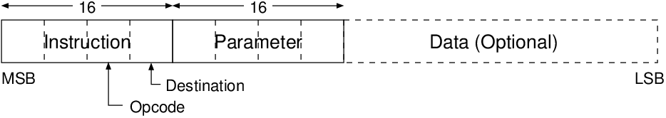
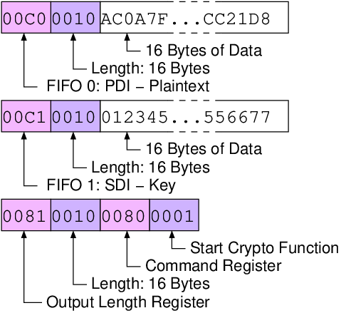

.. _dut-protocol:

==================
FOBOS DUT Protocol
==================

.. _fig_dut-protocol:

   FOBOS DUT Protocol

FOBOS uses the simple protocol shown in :numref:`fig_dut-protocol`. 
An instruction consists of an Opcode and a Destination.
The Opcode describes in which type of storage should be used. 
A **C** indicates a FIFO, an **8** a 32-bit register. This is immediately followed by the Destination, i.e., the 
FIFO or register number. Each instruction is followed by a Parameter. In case of FIFO, the parameter contains the 
number of bytes of data following. In case of Register, it contains the data to be stored in the selected register.
:numref:`tab_dut-protocol_instructions` shows the implemented Instructions and the purpose of the associated 
Parameters.

.. _tab_dut-protocol_instructions:
.. table:: FOBOS DUT Protocol Instructions

    +--------+-------------+-------------+---------+---------------------------------------+
    | Opcode | Destination | Storage     | Usage   | Parameter                             |
    +========+=============+=============+=========+=======================================+
    | C      | 0           | FIFO_0      | PDI     | length of data in bytes               |
    +--------+-------------+-------------+---------+---------------------------------------+
    | C      | 1           | FIFO_1      | SDI     | length of data in bytes               |
    +--------+-------------+-------------+---------+---------------------------------------+
    | 8      | 0           | Register 0  | cmd     | Command                               |
    +--------+-------------+-------------+---------+---------------------------------------+
    | 8      | 1           | Register 1  | outlen  | length of output in bytes             |
    +--------+-------------+-------------+---------+---------------------------------------+
    | 8      | 2           | Register 2  | rndlen  | length of random data in 32-bit words |
    +--------+-------------+-------------+---------+---------------------------------------+
    | 8      | 3           | Register 3  |         |                                       |
    +--------+-------------+-------------+---------+---------------------------------------+
    | 8      | 4           | Register 4  | seed0   | Part of seed for RNG                  |
    +--------+-------------+-------------+---------+---------------------------------------+
    | 8      | 5           | Register 5  | seed1   | Part of seed for RNG                  |
    +--------+-------------+-------------+---------+---------------------------------------+
    | 8      | 6           | Register 6  | seed2   | Part of seed for RNG                  |
    +--------+-------------+-------------+---------+---------------------------------------+
    | 8      | 7           | Register 7  | seed3   | Part of seed for RNG                  |
    +--------+-------------+-------------+---------+---------------------------------------+

The FOBOS DUT Protocol implements two commands:

1. Start the cryptographic operation.
2. Generate *rndlen* 32-bit words of random data and put them into the RDI FIFO.

:numref:`fig_testvector` shows an example of a test vector for a block cipher. First 128-bit (16 Bytes) of plaintext are 
send for FIFO-0, then 128-bit (16 Bytes) of key for FIFO-2, followed by the expected cyphertext length 
of 128-bit (16 Bytes) and the command to start encryption.

.. _fig_testvector:

   FOBOS Block Cipher Test Vector

