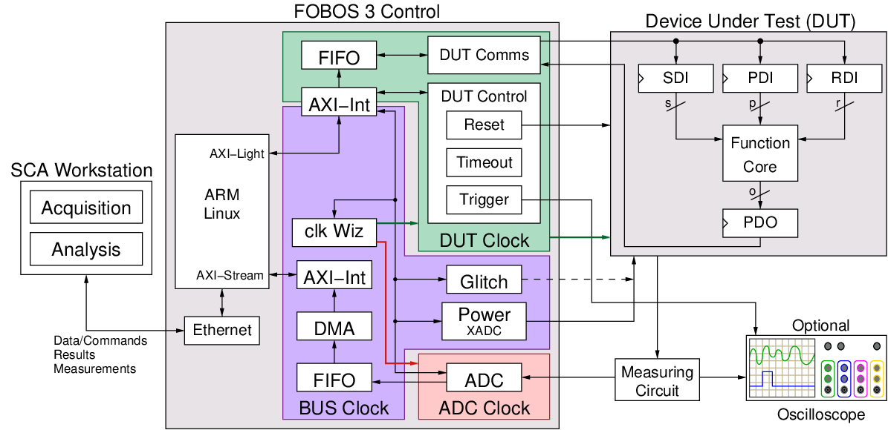

.. _tvgen-label:

Test Vector Generation
**********************

The user must prepare test vectors before running data acquisition. User defined scripts or scripts provided with FOBOS can be used.
The data acquisition scripts will send the test vectors one at a time and collect traces from the oscilloscope.

Cryptographic hardware interfaces typically use multiple data types as input to cryptographic cores. 
For example, some algorithms might need plaintext/ciphertext, cryptographic keys, and random data. 
We provide a simple wrapper to split data provided by the control board to separate streams. 
This wrapper is directly compatible with CAESAR Hardware API interface and is expected to be directly compatible with a future Hardware API for Lightweight Cryptography (LWC API). 
We developed a simple, yet versatile protocol to enable the wrapper to split the data types. 
The wrapper receives data from the control board and distributes it into three FIFOs:

1. The Public Data Input (PDI) FIFO (i.e. plaintext) 
2. The Secret Data Input (SDI) FIFO (i.e. key) 
3. The Random Data Input (RDI) FIFO which stores random data which can be used for protected implementations that use masking schemes.

Once the wrapper prepares the data for the function core, it starts the core which consumes the data in the input FIFOs and produces output. 
The wrapper accumulates the output into a fourth FIFO called the Data Out (DO) FIFO until the expected number of bytes are stored. 
Then, the wrapper returns the data to the control board which forwards it back to the PC.

   FOBOS2 block diagram

.. toctree::
   :maxdepth: 1

   dut_protocol

Using the blockCipherTVGen.py script
====================================
The blockCipherTVGen.py can be used to generate test vectors to be used by block ciphers. The script is located at fobos/software/tvgen/
There are two steps to use it:

1. Set user defined parameters.
2. Run the script. It will generate the test vector file and plaintext file (not required for acquisition).

Example: Generating AES-128 test vectors
----------------------------------------

AES-128 takes 16 bytes (128 bits) plaintext, 16 key and returns 16 byte ciphertext.
Here is an example to generate 4 test vectors with 16 byte blocks, key and ciphertext. Key is fixed in this case.

Settings::

    ############user defined settings
    TRACE_NUM = 1000                           # Number of traces
    PDI_LENGTH = 16                            # In byets
    SDI_LENGTH = 16                            # In bytes
    EXPECTED_OUT = 16                          # Expected output in bytes
    DIN_FILE = 'dinFile.txt'                   # Desitination file name
    PLAINTEXT_FILE = 'plaintext.txt'           # Desitination file name
    FIXED_KEY = 'yes'                          # Fixed key = yes | no
    KEY = '123456789009876ABCDFE12456789ABF'   # Fixed key

To run the script, use the following command::

    $ python blockCipherTVGen.py 

Here is how the generated dinFile.txt looks like.::

    $ cat dinFile.txt 
    00C000103AD5305EBD0C99C7482263E2D7ECEAED00C1001012345...0081001000800001
    00C000105C09504D713BF9B5925601E671EA257800C1001012345...0081001000800001
    00C00010A6D6DE2548E4CCF446ECA8E620E4E55500C1001012345...0081001000800001
    00C00010E0792CDE9AFDA7EAC33A8D0EADE524CB00C1001012345...0081001000800001
    00C000104A09A00A4C4268F0B6F4FCE4F514A6BB00C1001012345...0081001000800001

This file can now be used in FOBOS as a test vector file.

A plaintext.txt file is also generated, it includes only the PDI portion dinFile.txt::

    $ cat plaintext.txt 
    3A D5 30 5E BD 0C 99 C7 48 22 63 E2 D7 EC EA ED
    5C 09 50 4D 71 3B F9 B5 92 56 01 E6 71 EA 25 78
    A6 D6 DE 25 48 E4 CC F4 46 EC A8 E6 20 E4 E5 55
    E0 79 2C DE 9A FD A7 EA C3 3A 8D 0E AD E5 24 CB
    4A 09 A0 0A 4C 42 68 F0 B6 F4 FC E4 F5 14 A6 BB

This file can be used later by the analysis module.

Manually Generation of FOBOS-ready TVLA test vectors 
====================================================

Install CryptoTVGen
-------------------

Requirements:

OS: Tested on Linux and macOS

Dependencies:	

* Python 3.6.5	
* GNU Make 3.82	
* C compiler (e.g. gcc or clang)	

Install the latest version of CryptoTVGen::

 $ python3 -m pip install -U 'git+https://github.com/GMUCERG/LWC#subdirectory=software/cryptotvgen&egg=cryptotvgen'

To automatically download, extract, and build reference library of all LWC Round 2 candidates from the latest available version of SUPERCOP::

 $ python3 -m cryptotvgen.cli --prepare libs 
 
It installs all the available reference libraries to the directory shown below::

.cryptotvgen/supercop

Generating test vectors
-----------------------

All the necessary python scripts can be found in the following folder::

 /fobos/software/lwc_tools

All the generated output files can be found in the following folder::

 /fobos/software/lwc_tools/KAT
 
Generate an LWC test vector. This can be a short test vector. For example to generate test vectors for Xoodyak (refer cryptotvgen help for more information)::

 cryptotvgen --npub_size 128 --tag_size 128 --aead xoodyakv1 --gen_custom False,False,16,16,False

Convert into shared format (in this example 2 shares)::

 python3 gen_shared.py --rdi-file rdi.txt --pdi-file pdi.txt --sdi-file sdi.txt --rdi-width 384 --pdi-width 32 --sdi-width 32 --pdi-shares 2 --sdi-shares 2 --rdi-words 1000

Convert to FOBOS-ready TVLA test vectors::

 python3 lwc_2_fobos_tv.py --width 32 --shares 2 --num_vectors 10 --pdi_file pdi_shared_2.txt --sdi_file sdi_shared_2.txt --do_file do.txt

Where::

 --npub_size: size of the public message number in Bytes
 --tag_size: size of the tag in Bytes
 --aead: algorithm variant name
 --gen_custom: Randomly generate multiple test vectors, with each test vector specified using the following fields.
 --gen_custom NEW_KEY (Boolean), DECRYPT (Boolean), AD_LEN, PT_LEN or CT_LEN or HASH_LEN, HASH (Boolean)
 --rdi-width: width of the rdi port in Bits
 --rdi-words: number of random words in Bytes
 
Final output contains two files and are shown below::
 
 fvrchoicefile.txt
 dinFile.txt
 

