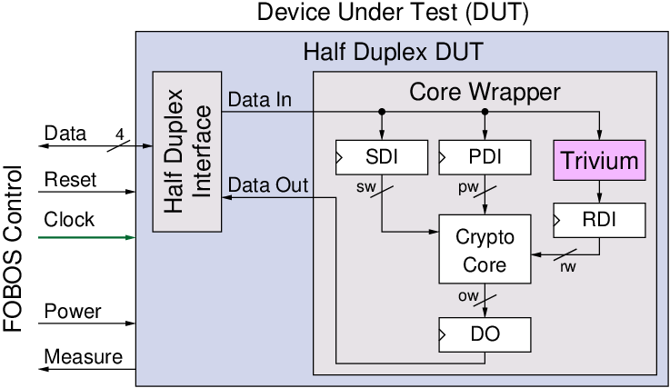

.. _tvgen-label:

Test Vector Generation
**********************

The user must prepare test vectors before running data acquisition. User defined scripts or scripts provided with FOBOS can be used.
The data acquisition scripts will send the test vectors one at a time and collect traces from the oscilloscope.

Cryptographic hardware interfaces typically use multiple data streams as input to cryptographic cores. 
For example, some algorithms might need plaintext/ciphertext, cryptographic keys, and random data. 
FOBOS uses a simple protocol to transfer test vectors containing these data streams to the DUT. The 
**FOBOS DUT protocol** is described in :numref:`dut-protocol`.

FOBOS provides a simple test vector generator called **FobosTVGen**. It uses a key and generates a configurable number 
of test vectors with random data. Its usage is described in :numref:`FobosTVGen`. 

Furthermore, FOBOS can generate test vectors for hardware implementations that comply with the 
GMU LWC Hardware API :cite:`kaps_hardware_2022`.
FOBOS uses **CryptoTVGen**, which is part of the *Development Package for Hardware Implementations Compliant 
with the Hardware API for Lightweight Cryptography* :cite:`kamyar_mohajerani_development_2022`, to generate 
test vectors. A FOBOS tools then convert the test vectors generated by CryptoTVGen for use with FOBOS. 
Additionally, FOBOS has a tool that allows for the generation of test vectors  for 
Test Vector Leakage Analysis (TVLA) of unprotected and protected implementations that comply with the 
GMU LWC Hardware API. Creating GMU LWC Hardware API compatible testvectors for FOBOS is described in :numref:`CryptoTVGen`.

.. _fig_dut-block2:

   Block Diagram of FOBOS Wrapper for the DUT

.. toctree::
   :maxdepth: 1

   dut_protocol
   FobosTVGen
   CryptoTVGen

